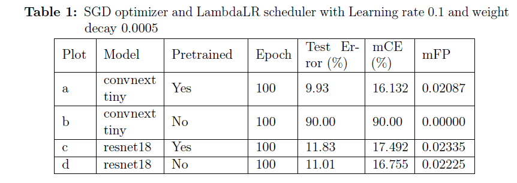
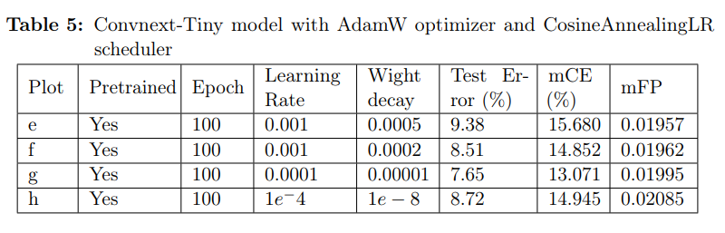
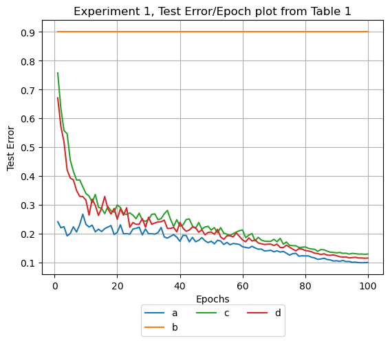
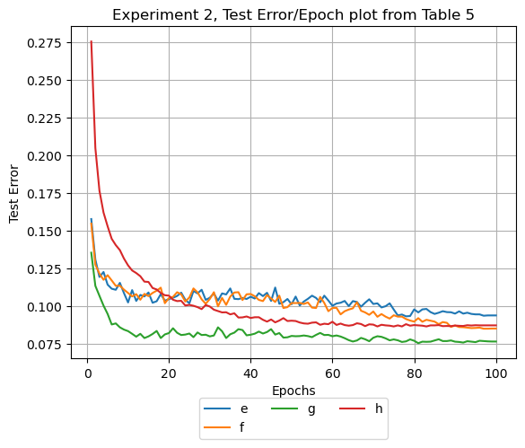

# AugMix


## Introduction

In this work model performance against change in data distribution was conducted to train the Rsnet18 and ConvNext-Tiny network with CIFAR-10 dataset with data augmentation technique using AugMix algorithm [ICLR 2020 paper](https://arxiv.org/pdf/1912.02781.pdf), and test on CIFAR-10, CIFAR-10C and CIFAR-10P.


## Pseudocode

## Contents

This directory includes a reference implementation in NumPy of the augmentation
method used in AugMix in `augment_and_mix.py`. The full AugMix method also adds
a Jensen-Shanon Divergence consistency loss to enforce consistent predictions
between two different augmentations of the input image and the clean image
itself.

We also include PyTorch re-implementations of AugMix on both CIFAR-10/100 and
ImageNet in `cifar.py` and `imagenet.py` respectively, which both support
training and evaluation on CIFAR-10/100-C and ImageNet-C.

## Requirements

*   numpy>=1.15.0
*   Pillow>=6.1.0
*   torch==1.2.0
*   torchvision==0.2.2

## Setup

1.  Install PyTorch and other required python libraries with:

    ```
    pip install -r requirements.txt
    ```

2.  Download CIFAR-10-C datasets

 3.  Download CIFAR-10-P datasets
 

## Usage

Training recipes used in our paper:

Resnet18(non-pretrained and non pretrained with SGD and LambdaLR): `python new_cifar.py -m renset18` or `python new_cifar.py -m renset18 -pt` 

Convnext-Tiny(non-pretrained and non pretrained with Adam and CosineAnnelingLR):`python new_cifar.py -m convnext_tiny -o AdamW -s CosineAnnealingLR` and `python new_cifar.py -m convnext_tiny -o AdamW -s CosineAnnealingLR -pt`

Similarly Laearning rate and weight decay could be included in the receipe with flag `-lr` and `-wd`

##Results






## Conclusion

In this work model performance against change in data distribution was conducted to train the Rsnet18 and ConvNext-Tiny network with CIFAR-10 dataset with data augmentation technique using AugMix algorithm and test on CIFAR-10, CIFAR-10C and CIFAR-10P. Non Pretrained Resnet18 model performed best with SGD and LambdaLR scheduler with Test error of 11.53% and mCE of 16.861%, and mFP of 0.02320 and Pretrained Convnext-Tiny model best performed with AdamW optimizer and CosineAnnealingLR scheduler with inital Learning rate of 0.0001 and weight decay of 0.00001, with Test error of 7.65%, mCE 13.071% and mFP of 0.01995, furthermore it was seen that lowering the learning rate and weight decay improved the model performance, therefore it is possible to achieve more accuracy with Convnext-Tiny model, which could be a topic of further work, also in the model training performed in this work above it was seen that model seem to achieve convergence at around 96 epoch..As seen in the Mean Flip Probability Plot although the Test error and Mean corruption error(mCE) is decreasing the perturbation in the dataset has either no effect or slightly lower value, this means the perturbation in dataset is not quite significant effect with change in hyperparameter.

## Citation

If you find this useful for your work, please consider citing

```
@article{hendrycks2020augmix,
  title={{AugMix}: A Simple Data Processing Method to Improve Robustness and Uncertainty},
  author={Hendrycks, Dan and Mu, Norman and Cubuk, Ekin D. and Zoph, Barret and Gilmer, Justin and Lakshminarayanan, Balaji},
  journal={Proceedings of the International Conference on Learning Representations (ICLR)},
  year={2020}
}
```
