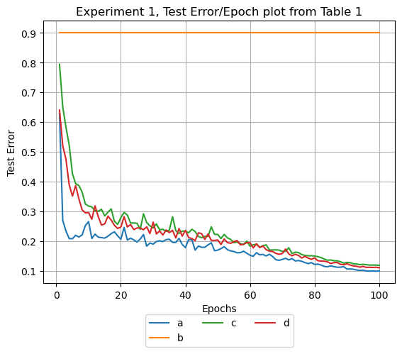

# AugMix


## Introduction

In this work model performance against change in data distribution was conducted to train the Resnet18 and ConvNext-Tiny network with CIFAR-10 dataset that is augmented using AugMix [ICLR 2020 paper](https://arxiv.org/pdf/1912.02781.pdf) data augmentation technique, and test on CIFAR-10, CIFAR-10C and CIFAR-10P.

Objectives:
  1. To Train the ResNet18 and ConvNext Tiny model on CIFAR-10 and evaluate on CIFAR-10, CIFAR-10C and CIFAR-10P 
  2. Deploying both network with:
        a) AdamW optimizer with CosineAnnealingLR learning rate scheduler.
        b) SGD optimizer with LambdaLR learning rate scheduler.
  3. Adding Tensorboard implementation to log Train and Test losses and deriving conclusion form the results.
  4. Hyper parameter Tuning  of the model to improve its performance.

## Requirements

*   numpy>=1.15.0
*   Pillow>=6.1.0
*   torch==1.2.0
*   torchvision==0.2.2

## Setup

1. Install PyTorch and other required python libraries with:

    ```
    pip install -r requirements.txt
    ```
2. In this work [timm](https://github.com/huggingface/pytorch-image-models.git) and [torchvisionX](https://github.com/lanpa/tensorboardX.git) library are also      included.
2. Download CIFAR-10-C datasets

 3.  Download CIFAR-10-P datasets
 

## Usage

Training recipes used in this work:

Resnet18(non-pretrained or pretrained with SGD + LambdaLR): `python new_cifar.py -m renset18` or `python new_cifar.py -m renset18 -pt` 

Convnext-Tiny(non-pretrained or pretrained with Adam + CosineAnnelingLR):`python new_cifar.py -m convnext_tiny -o AdamW -s CosineAnnealingLR` and `python new_cifar.py -m convnext_tiny -o AdamW -s CosineAnnealingLR -pt`

Similarly Learning rate and weight decay could be included in the receipe with flag `-lr` and `-wd`


##Results





## Conclusion

Non Pretrained Resnet18 model performed best with SGD and LambdaLR scheduler with Test error of 11.53% and mCE of 16.861%, and mFP of 0.02320 and Pretrained Convnext-Tiny model best performed with AdamW optimizer and CosineAnnealingLR scheduler with inital Learning rate of 0.0001 and weight decay of 0.00001, with Test error of 7.65%, mCE 13.071% and mFP of 0.01995, furthermore it was seen that lowering the learning rate and weight decay improved the model performance, therefore it is possible to achieve more accuracy with Convnext-Tiny model, which could be a topic of further work, also in the model training performed in this work above it was seen that model seem to achieve convergence at around 96 epoch.As seen in the Mean Flip Probability(mFp) Plot although the Test error and Mean corruption error(mCE) is decreasing as hyperparameter is changed, the perturbation in the dataset has either no effect or slightly lower value, this means the perturbation in dataset does not have significant effect on the model performance with change in hyperparameter.

## Citation

```
@article{hendrycks2020augmix,
  title={{AugMix}: A Simple Data Processing Method to Improve Robustness and Uncertainty},
  author={Hendrycks, Dan and Mu, Norman and Cubuk, Ekin D. and Zoph, Barret and Gilmer, Justin and Lakshminarayanan, Balaji},
  journal={Proceedings of the International Conference on Learning Representations (ICLR)},
  year={2020}
}
@misc{tensorboardX,
  author = {Tzu-Wei Huang},
  title = {tensorboardX},
  year = {2022},
  publisher = {GitHub},
  journal = {GitHub repository},
  howpublished = {\url{https://github.com/lanpa/tensorboardX.git}},
  commit = {5c03c643d8c4fefdd4ed493326baa7b1ed085662}
}

@misc{rw2019timm,
  author = {Ross Wightman},
  title = {PyTorch Image Models},
  year = {2019},
  publisher = {GitHub},
  journal = {GitHub repository},
  doi = {10.5281/zenodo.4414861},
  howpublished = {\url{https://github.com/rwightman/pytorch-image-models}}
}

```
